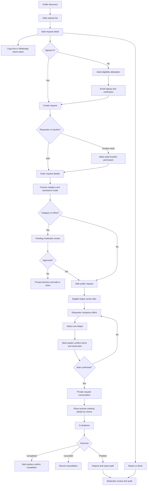
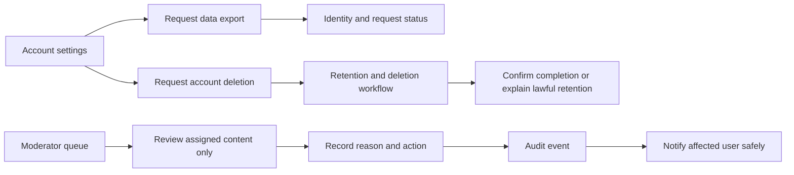

# Wireflow map

This is a requirements-level map for Phase 1. Phase 2 will add screen-level wireframes and loading, empty, error, offline, validation, denied, expired, and cancelled states.

## Request and helper journey

## Account and moderation journeys

## Privacy boundary

Public pages and share previews use only allowlisted fields: category, coarse city/region, broad date, assistance mode, language, and moderated summary. They omit exact address, phone number, precise itinerary, booking code, identity document, private meeting point, and messages. Phases 6, 8, and 9 must test the actual API and metadata outputs against this boundary.
